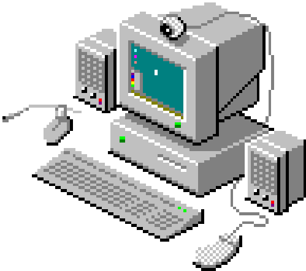

<!-- ### Hello World!  -->

<p align="left">

# Hi, I'm hyperwolf248! 


</p>


## My Tech Skills:

### Programming Languages

&nbsp;
&nbsp;
&nbsp;
&nbsp;
&nbsp;
&nbsp;

### Database Systems

&nbsp;
&nbsp;

### Tools and Frameworks

&nbsp;
&nbsp;
&nbsp;
&nbsp;
&nbsp;
&nbsp;
&nbsp;

### Operating Systems

&nbsp;
&nbsp;
&nbsp;    

<hr>

##  A little more about me...

```py
class hyperwolf248:
    def __init__(self):
        self.username = 'hyperwolf248'
        self.age = 21
        self.name = 'Keerthi Gowda'
        self.languages = {
            "English":  "Intermediate",
            "Hindi":   "Native language"
        }
        self.education = {
            "Programming": (
                ["IT and Data Security", "Microsoft's Sans Park"]
                ["Python & Javascript", "Self Education"],
                ["Linux Usage", "Self Education"],
                ["Pentesting", "Hack The Box"]
            ),
            "B.E": "RV College of Engineering",
        }
    def __str__(self):
        return self.name
if __name__ == '__main__':
    me = hyperwolf248()
```


<hr>

<p align="center">
  <a href="https://github.com/hyperwolf248">
    
    
  </a>
</p>
